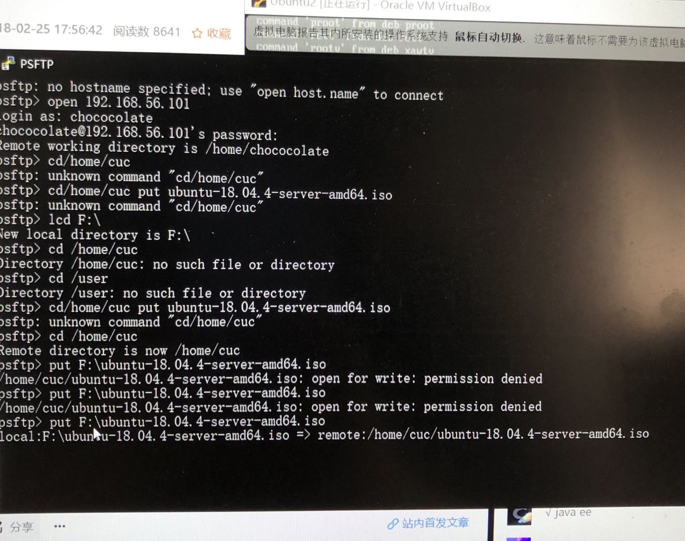
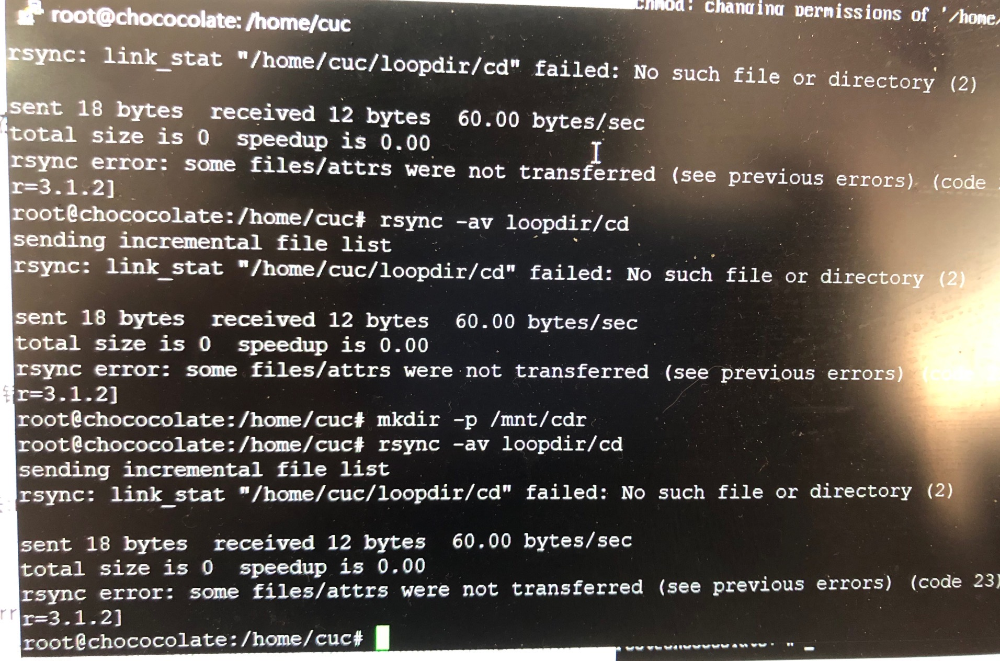
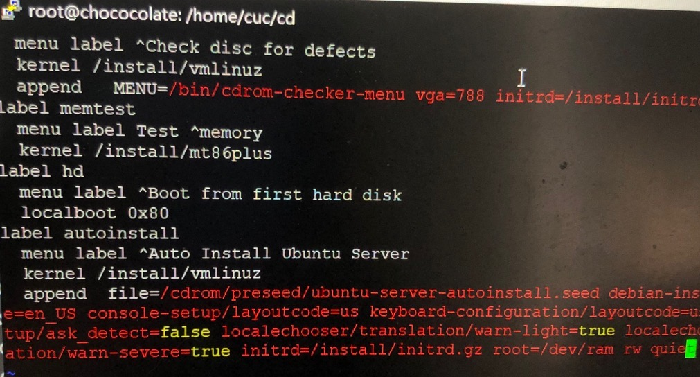
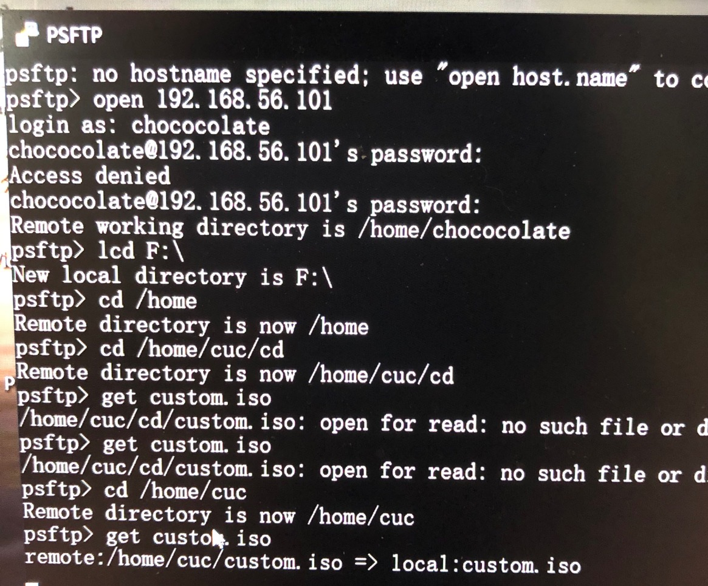

#### Ubuntu无人值守镜像安装制作

###### step 1.
将虚拟机设置为双网卡（NAT+hostonly）
###### step 2.
启动虚拟机（chococolate），在命令行里输入“ifconfig -a”。

此时发现有网卡未启动没找到IP地址，又输入“sudo ifconfig enp0s8 up”和“sudo dhclient enp0s8”

再次输入“ifconfig -a”获得网卡IP：192.168.56.101
###### step 3.
下载putty,输入IP地址连接主机和虚拟机。
(在这一步出现第一次错误：连接时被拒绝，而本地能够ping通虚拟机。上网搜索原因是没有开启sshd服务。然后去安装sshd,安装失败！继续上网搜索被告知要更新软件包，执行了“sudo apt-get update”及“sudo apt-get upgrade”，更新真的要好久好久=^= )
###### step 4.
下载PSFTP，学习相关语法（个人感觉还是很友好），将ubuntu-18.04.4-server-amd64.iso（这里放在了F盘）放进虚拟机。

（这里出现第二次错误，permission denied。又是一顿搜索后了解到是权限问题，这个问题在接下来的操作中也频繁出现，要用"chomd -R 777 xxx"给权限）

###### step 5.
在putty中/home/cuc下执行以下命令：
* "mkdir loopdir" 创建用于挂载iso文件的目录（当然要自己先建好cuc文件夹）；

* “mount -o loop ubuntu-18.04.4-server-amd64.iso loopdir”挂载iso文件到loopdir（第三个报错出现了：mount point not exist,这是我的锅 = = ）；

* “rsync -av loopdir/ cd”同步光盘内容到工作目录（/ cd之间有空格有空格有空格!!!又是自己的锅导致第四个报错，网上搜索报错被什么.conf文件没开权限整崩溃，后来发现是庸人自扰!）；

* "umount loopdir"卸载iso镜像；

###### step 6.
“cd cd/”进入工作目录
* “vim isolinux/txt.cfg”编辑Ubuntu安装引导界面增加新菜单项入口；

* 将“label autoinstall
  menu label ^Auto Install Ubuntu Server
  kernel /install/vmlinuz
  append  file=/cdrom/preseed/ubuntu-server-autoinstall.seed debian-installer/locale=en_US console-setup/layoutcode=us keyboard-configuration/layoutcode=us console-setup/ask_detect=false localechooser/translation/warn-light=true localechooser/translation/warn-severe=true initrd=/install/initrd.gz root=/dev/ram rw quiet“

  加入文件后强制保存退出（到这一步真的整蒙了，后来搜素学习后才知道这是在vim编辑器界面，通过相关语法进行操作，u1s1,这语法太不友好了= = ）

###### step 7.
下载老师的.seed文件到本地F盘，并通过PSFTP传到/home/cuc/cd/preseed下。（又一个崩溃点，自己误解了课件上老师的意思，一位ubuntu-server-autoinstall.seed本来就在preseed文件里，在里面dir半天差点以为要重做，后来问了师姐才知道真正的意思，害，背上的锅又重了一些...）
###### step 8.
输入“cd ~/cd && find . -type f -print0 | xargs -0 md5sum > md5sum.txt”重新生成md5sum.txt.(第五个错误,可能是代码不太适应，自己改成在cd下执行"find . -type f -printf0 | xargs -0 md5sum > md5sum.txt")
###### step 9.
封闭改动后的目录到.iso
* IMAGE=custom.iso
BUILD=~/cd/
* mkisofs -r -V "Custom Ubuntu Install CD" \
-cache-inodes \
-J -l -b isolinux/isolinux.bin \
-c isolinux/boot.cat -no-emul-boot \
-boot-load-size 4 -boot-info-table \
-o $IMAGE $BUILD
(6th error:Invild node 询问了同学才知道这里是因为路径无效，还是前面的不适应问题，手动改了“BUILD=/home/cuc/cd/")

###### step 10.
用PSFTP将custom.iso文件复制出来，创建新的虚拟机，配置并执行，去喝咖啡！
