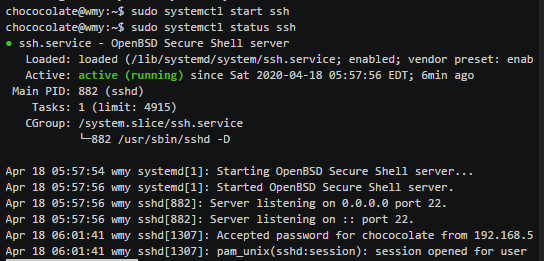
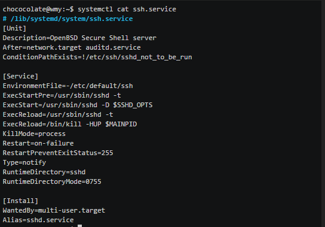

## Exp3 Systemd

### 1.实验环境
* Ubuntu 18.04.4 Server 64bit
* PuTTY 64bit

### 2.实验要求
- 阅读阮一峰的「Systemd 入门教程：命令篇」与「Systemd 入门教程：实战篇」并进行动手实操
- 按照入门教程的章节划分分段录屏上传到asciinema，并按照见名知意的标准编辑录像文件名
- 完成课后自查清单

### 3.实验过程
#### step1.
[系统管理操作视频上](https://asciinema.org/a/zxxZCvnCyRea6PU025aCcWTjb)

[系统管理操作视频下](https://asciinema.org/a/6gkpm0yc4vdr7bVKarYw2fTOW)

遇到的问题:
* 在执行timedatectl list-timezones 进程信息过长，退出时执行了"ctrl-z",以致exit asciinema 时出现"there are stopped jobs",后经过搜索发现正确应该执行"ctrl-c",两者区别在于前者将前端进程暂停移至后端，而后者直接结束进程（可能是我没注意这个细节，被坑了==）
* 在执行"sudo timedatectl set time YYYY-MM-DD"时报错无法修改时间，后搜索后发现原因是系统默认自动同步时间，需执行"sudo timedatectl set-ntp no"将自同步取关方能修改
#### step2.
[unit管理](https://asciinema.org/a/01Crl4TfKc7Bedjh8CuveWBXV)

[unit配置](https://asciinema.org/a/LcGqzig1GCZX8LQivNUL04Mk5)

[Target](https://asciinema.org/a/CPg58o4K9h7Y0JWCWnSd4qvcC)

[Journal](https://asciinema.org/a/BY4MRdkZ2ZGNBGldicSQjcLuJ)

遇到的问题：
* 发现自己没装Apache以及Bluetooth、httpd.service could not found.自己手动下载了Apache2，不太理解httpd与Apache的关系（看博客相关的配置有、复杂）
#### step3.
[System服务启动，停止及配置](https://asciinema.org/a/Sow0r3VuktdqwT4Cism5ijiaJ)

遇到的问题：
* httpd.service not found,就以ssh.service为例进行理解（有努力去解决无法开启httpd服务，只是能力有限没有改正过来(╥╯^╰╥)）

#### step4.
**服务状态解读**：

+ 该服务配置文件位置为/lib/systemd/system/ssh.service，已设为开机启动；

+ 正在运行；

+ 主进程PID为882；

**配置文件解读**：

+ 如果network.target或者auditd.service需要启动，ssh在其后启动；
+ 启动该服务前执行的命令：/usr/sbin/sshd -t;
+ 重启服务执行的命令：/bin/kill -HUP $MAINPID 或者 /usr/sbin/sshd -t;
+ 启动类型为：notify启动结束后会发出通知信号，systemd再启动其他服务；
+ 停止类型为process,只杀主进程；
+ 重启方式为on-failure 非正常退出时（退出状态码非0），包括被信号终止和超时，才会重启；
+ 该服务所在的Target为multi-user.target;

### 4.自查清单
 1.如何添加一个用户并使其具备sudo执行程序的权限？
>adduser username 
>
>方法1.sudo usermod -a -g sudo username
>
>方法2.修改 /etc/sudoers 文件
>
>##Allow root to run any commands anywhere
>
>root    ALL=(ALL)     ALL
>
>username   ALL=(ALL)     ALL//新增信息

2.如何将一个用户添加到一个用户组？
>已存在用户：usermod -a -G groupname username
>
>增加新用户：usermod -G groupname username

3.如何查看当前系统的分区表和文件系统详细信息？
>1.sudo cfdisk 可查看机器的中的磁盘分区状况及所用的文件系统
>
>2.sudo part默认是打开的设备是/dev/hda ，也可以自己指定；比如 parted /dev/hda 或/dev/sda 等；退出的方法是 quit 
>
>3.df -h 可以查看磁盘的使用情况以及文件系统被挂载的位置
>
>4.sudo sfdisk -l列磁盘分区情况的功能
>
>5.ldblk

（个人使用感：1,2适合修改，其中更喜欢1，感觉有点像DOS系统界面；后三个属于同一梯队，适合查询，后三个里更喜欢df -h不需要sudo且布局简洁，系统自带~）

4 如何实现开机自动挂载Virtualbox的共享目录分区？
>1.在vbox界面设置好共享文件夹，如F：/pigg;
>
>2.在虚拟机内新建文件路径，如sudo mkdir /mnt/share;
>
>3.实现挂载：sudo mount -t vboxsf pigg /mnt/share
>
>4.实现开机自动挂载：vim /etc/rc.local
>追加：sudo mount -t vboxsf pigg /mnt/share
>
5.基于LVM（逻辑分卷管理）的分区如何实现动态扩容和缩减容量？
>扩容：lvextend -L + Bit+path
>
>缩减：lvreduce -L + Bit+path

6.如何通过systemd设置实现在网络连通时运行一个指定脚本，在网络断开时运行另一个脚本？
>修改配置文件
>vim /lib/systemd/systemd-networkd.service
>[Service]
 >1.在vbox界面设置好共享文件夹，如F：/pigg;
>
>RxecStart=systemd service1 start
>
>RxecStop=systemd service2 start
>
>Type=forking
7.如何通过systemd设置实现一个脚本在任何情况下被杀死之后会立即重新启动？实现杀不死？
>修改配置文件
>
>vim /lib/systemd/system/application.service
 [Service]
 >
>Restart=always
>
>RestartSec=1
>
>Type=forking
>
>PIDFile=/run/application.pid
>
>执行
>
>systemctl daemon-reload
>
>systemctl start application
### 5.参考资料
* 阮一峰Systemd教程
* CSDN Linux博客（~~太多列举不过来~~）